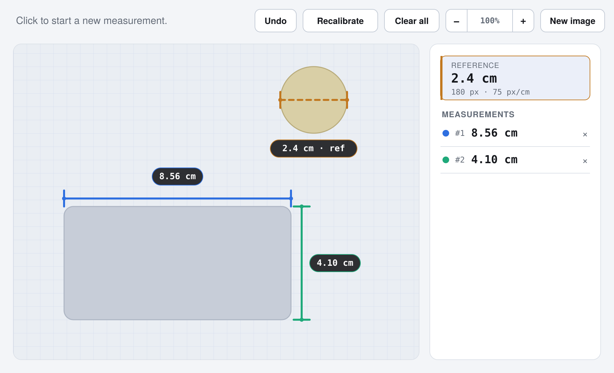
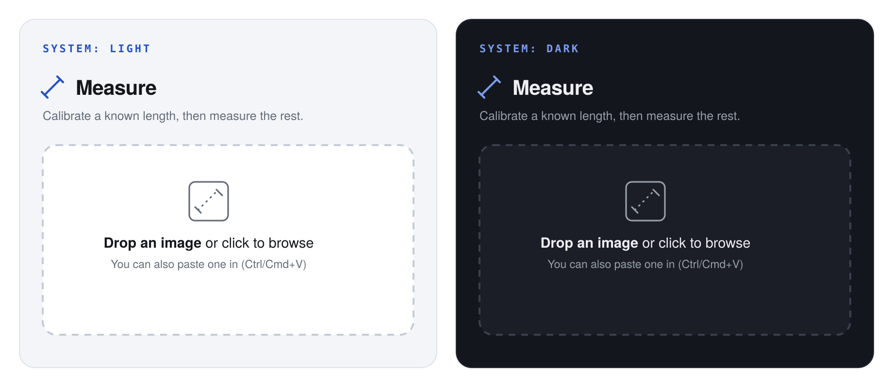

# Measure

A small web app for pulling real-world measurements out of a photo. Drop in an image, draw a line over something whose length you already know, and every line you draw after that gets converted automatically.

## How it works

1. **Drop in an image.** Any photo, screenshot, or scan — drag it in, click to browse, or paste it with Ctrl/Cmd+V.
2. **Draw a reference line.** Click one end of something you know the real length of (a coin, a ruler, a door, a credit card), then click the other end.
3. **Enter its real length.** Type the length and a unit. That sets the scale for everything else.
4. **Draw more lines.** Each one is measured automatically and added to the list on the right.

## Features

- **No install, no server.** It's a single HTML file — open it in a browser and it works, offline included.
- **Automatic light/dark mode**, matched to your system on Windows, macOS, and Linux.
- **Recalibrate any time** — redraw the reference line and every existing measurement updates to the new scale.
- **Zoom and pan** for precise clicking on large or detailed images.
- **Undo** (button or Ctrl/Cmd+Z), plus delete any single measurement from the list.
- Works with any unit — mm, cm, m, in, ft, or your own.

  

## Getting started

No install, no build step — it's one self-contained HTML file.

1. Download `image-measure.html` from this repo (or clone it).
2. Open it directly in your browser — double-click it, or drag it into a browser window.

To publish it as a live link instead, turn on **GitHub Pages** for this repo (Settings → Pages) and point it at `image-measure.html`.

## Good for

- Measuring an object in a product photo using a coin or card for scale
- Estimating dimensions from a floor plan or site photo
- Tracking the size of something over time (a plant, a crack, a bruise) using the same reference object each time
- Any one-off measurement where you don't have the original object on hand — just a photo of it next to something you can measure

## Tips

- **Recalibrate** if your first reference line wasn't quite right — it re-measures everything you've already drawn against the new scale, it doesn't just reset it.
- Hold **Ctrl/Cmd and scroll** to zoom in for pixel-precise clicks; scroll or drag normally to pan around.
- Press **Esc** to cancel a line you're in the middle of drawing.
- Accuracy depends on your reference line and image resolution — pick a reference object close in size to what you're measuring, and keep the camera as square-on to the subject as possible.

## License

GPLv3